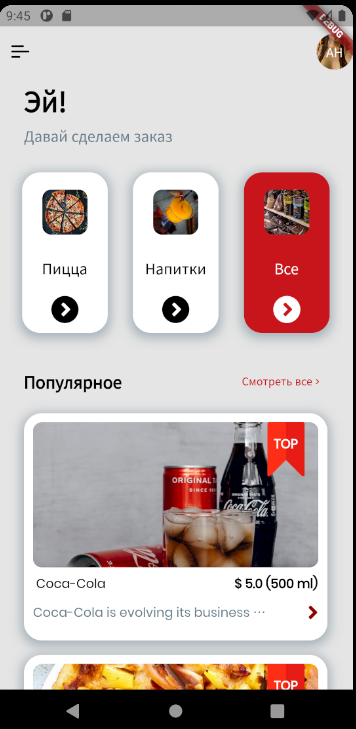
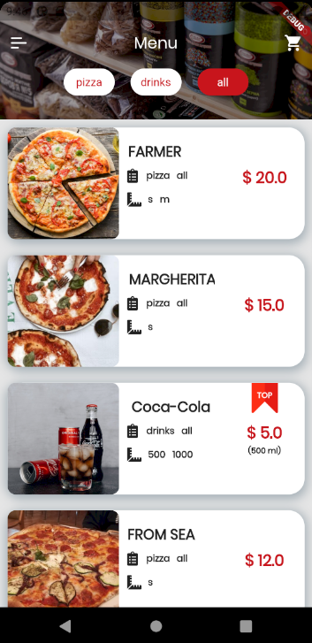
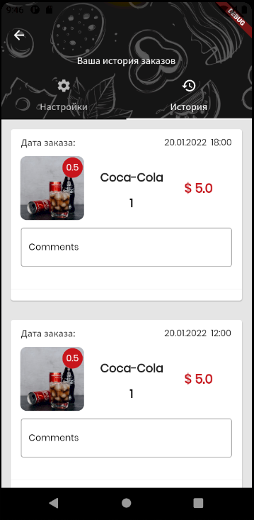

# Pizza time

Application for ordering products





## Getting Started

- Install flutter and set up a development environment.
- Add google-services to the desired directory. If necessary, change the settings according to the instructions of firebase.
- Create env.dart file in lib
```
class Env {
  static const String MapboxApiKey = <YOU_KEY_API>";
  static const String orderKey = <secret_key>;
}
```
- Replace 'YOU_KEY_API' and 'secret_key' with the received key

## ENV
- MapboxApiKey - is used to search for a city
- orderKey - sends the key when placing an order to firebase. You can set any value.
## Checking work
Proposition works on android API 30 and 27, but has not been tested on ios

## Some of the libraries used are
- firebase
- redux, flutter_redux
- redux_epics and rxdart
- mapbox_search
- geolocator
- flutter_i18n
